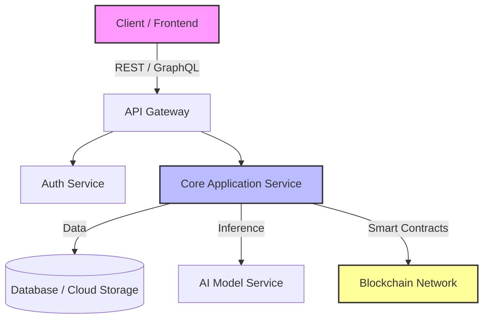

<div align="center">

# Hi there, I'm Batuhan Acan 👋

### Full-Stack Developer | AI & Blockchain Enthusiast | Cloud Architect

[](https://batuhanacan.netlify.app/)
[](https://www.linkedin.com/in/batuhanacan221/)


</div>

---

## 👨‍💻 About Me

I am a Senior **Computer Engineering student at Altınbaş University**, currently bridging theory and real-world application.  
My academic journey also includes a transformative **Erasmus+ experience at Politechnika Białostocka** (Poland), which strengthened both my technical adaptability and cultural awareness.

I am currently contributing to **SkyTrade** as a Full-Stack Development Intern, focusing on scalable architectures, cloud-native workflows, and integrations involving AI & blockchain technologies.

- 🔭 **Currently working on:** Full-stack development @ SkyTrade  
- 🌱 **Exploring:** Cloud Architecture, LLM integrations, Web3  
- 🌍 **Languages:** English, Turkish, JavaScript, Python

---

## 🛠️ Technical Arsenal

I build end-to-end modern applications using a wide and reliable tech stack.

| Domain | Technologies & Tools |
| :--- | :--- |
| **Frontend** |     |
| **Backend** |    |
| **AI & ML** |    |
| **Blockchain** |    |
| **Cloud & DevOps** |    |

---

## 🚀 Preferred Architecture & Workflow



---

## 📂 Featured Projects

| Project | Description | Tech Stack |
| :--- | :--- | :--- |
| **[Personal Portfolio](https://batuhanacan.netlify.app/)** | A clean and interactive portfolio showcasing my journey and projects. | `React`, `Netlify`, `CSS3` |
| **SkyTrade Integration (Internship)** | Contributing to trading platform development. *Details may be restricted due to NDA.* | `Full Stack`, `API Development` |
| **AI Content Generator** | A tool leveraging LLMs to generate marketing content. | `Python`, `OpenAI API`, `Streamlit` |
| **DeFi Exchange** | Prototype decentralized exchange for token swaps. | `Solidity`, `Ethers.js`, `React` |

---

## ⚙️ Installation & Usage (General)

### Clone the repository
```bash
git clone https://github.com/batuhanacan221/your-repo-name.git
```

### Install dependencies
```bash
cd your-repo-name
npm install
```

### Run development server
```bash
npm run dev
```

---

## 🗺️ Roadmap

- [x] Complete Erasmus Exchange at **Politechnika Białostocka**  
- [x] Secure Internship at **SkyTrade**  
- [ ] Graduate from **Altınbaş University**  
- [ ] Build a decentralized SaaS platform  
- [ ] Earn AWS Solutions Architect Certification  

---

## 📬 Connect with Me

<p align="left">
<a href="https://www.linkedin.com/in/batuhanacan221/" target="_blank">

</a>

<a href="https://batuhanacan.netlify.app/" target="_blank">

</a>

<a href="mailto:your-email@example.com" target="_blank">

</a>
</p>

---

<p align="center">
<i>"Simplicity is the soul of efficiency."</i>
</p>
